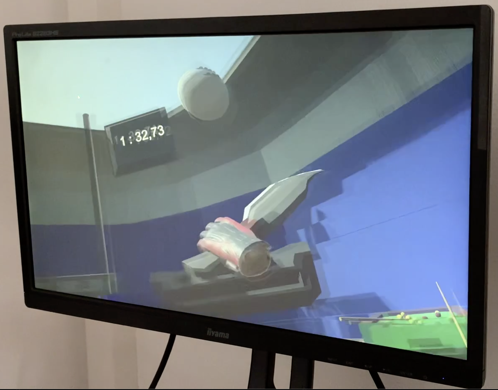
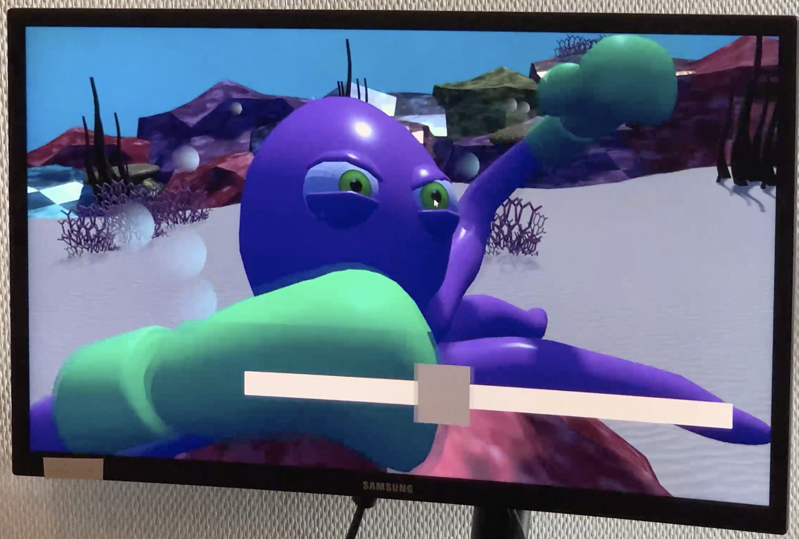

# workshop_game_VR_2020

Ce dépot regroupe les projets réalisés en trois jours par des étudiants en troisième année d'option game expérience design à l'école de design Nantes Atlantique dans le cadre d'un workshop dédié à la réalité virtuelle utilisant [Unity](https://unity.com/fr). Un objet a été imposé à chaque groupe au jour 2 du workshop !

Builds, fichiers projets et videos disponibles dans la section release.

This repo stores the projects done by game ux design students at l'École de design Nantes Atlantique during a workshop dedicated to virtual reality in 3 days with  [Unity](https://unity.com/). Teams had to use a challenge object on day 2, they had to use this new object in their project !

Build, projects files and videos available in the release section.

## Fencing's revenge

**par Yohan Meunier, Mathieu Labbey, Lucas Pariset, Albane Herry et Samuel Rouault**       

Objet imposé : un sac remplit de coton !

  

Le concept original est de trancher des ballons, issus de divers sports, avec soit des sabres d’escrime, soit des couteaux de jet. Gare en revanche aux boules de bowling, qui elles peuvent briser nos sabres.

 

## Cyber Axe

**par Chaïnèze D’Almeida, Loïc Edoh, Romain Lalitch et Flore Quittet**

Objet imposé : une chaise sur roulette !

  

Le sport est du lancé de haches augmentés, par la possibilité d’augmenter la taille de sa hache et de la refaire revenir à l’emplacement d’origine où se situe le joueur. Les “pouvoirs” sont utilisés si le joueur à assez de manaa qui peut récupérer lors- qu’il se repose (il s’assoit sur une chaise) mais attention, il ne pourra pas lancer de hache pendant les pauses qu’il s’octroie.
Il doit détruire le plus de robots possible qui augmentera son score dans un temps imparti. Le but est d’avoir le plus gros score mais parfois les robots peuvent aussi faire baisser le score s’ils atteignent le stand de tir.

 

## Shifu Boxe

**par Guillaume Carle, Steeve Dossou, Camille Ledentu et Jade Guilbot**

Objet imposé : un ballon rebondissant !

  

Le jeu prend place dans un univers aquatique. Une partie de jeu dure 3min et le but est de battre Poulpo le poulpe lors d’un combat de boxe.

 
